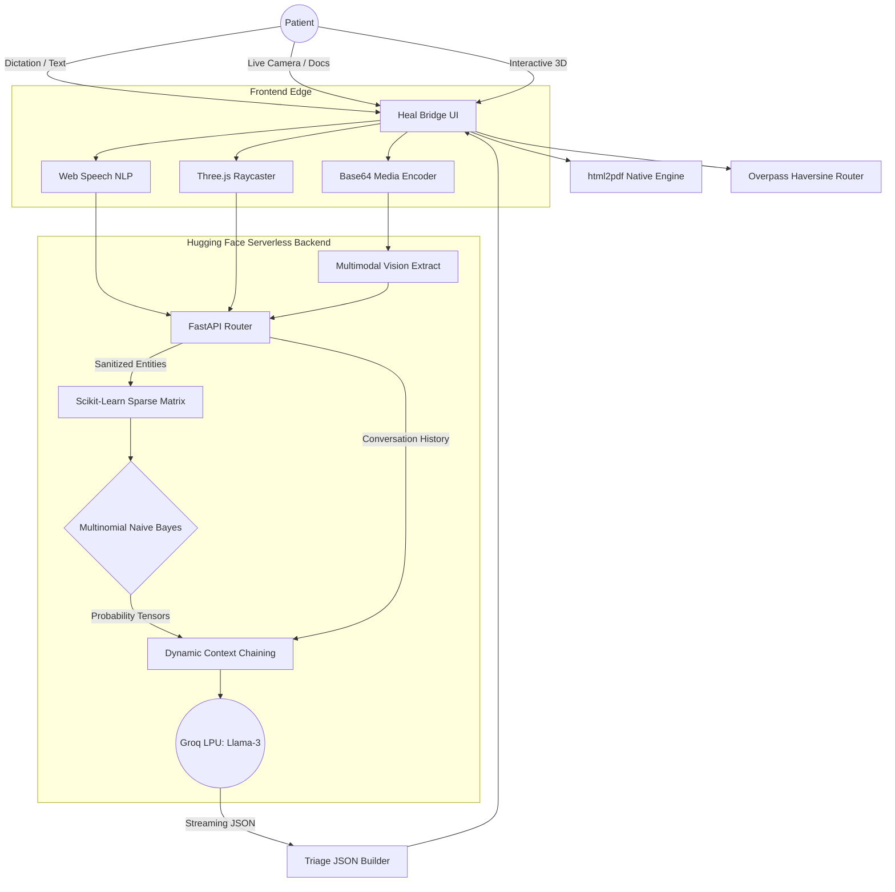
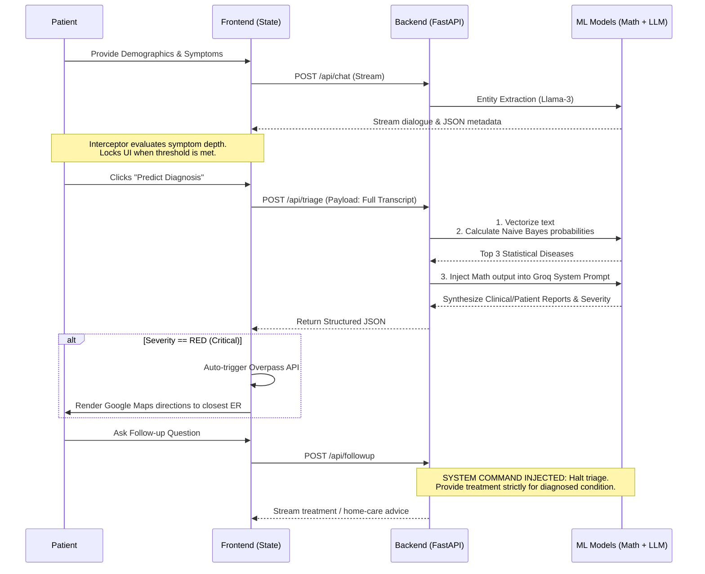

# 🩺 Heal Bridge | Autonomous AI Medical Triage System

<div align="center">
  <!-- 📸 INSERT HERO SCREENSHOT HERE: A wide, high-res shot of the desktop dashboard showing the 3D body mapper or the Glassmorphism UI -->
  
</div>


**Heal Bridge** is an institutional-grade, autonomous medical triage pipeline engineered to completely eliminate initial assessment wait times. Built with strict clinical guardrails and a zero-persistence privacy architecture, it utilizes a proprietary **Dual-Engine Triage System**. By mathematically anchoring a Generative AI (Llama-3) to a deterministic probability classifier (Naive Bayes), the system safely processes multimodal symptoms, calculates exact disease probabilities, and dynamically routes critical patients to nearby emergency facilities.

---

## 📸 Interface & Modalities

<div align="center">
  <!-- 📸 INSERT SCREENSHOT HERE: Show the 3D Three.js body mapper modal -->
  
  <!-- 📸 INSERT SCREENSHOT HERE: Show the PDF Report generation -->
  
  <!-- 📸 INSERT SCREENSHOT HERE: Show the Map/GPS Hospital routing -->
  
</div>

---

## 🧠 The "Tri-Model" Machine Learning Stack

Large Language Models (LLMs) are inherently generative, making them dangerous for raw medical diagnosis due to hallucinations. Heal Bridge neutralizes this risk by compartmentalizing the inference pipeline across three distinct engines. 

### 1. Multimodal Vision Engine (Data Extraction)
When a user uploads clinical documents (lab results, PDFs) or live camera snapshots of physical symptoms, the Vision Engine acts as the primary OCR and clinical extractor. It bypasses manual data entry, stripping noise to inject a structured array of verified symptoms directly into the secure session transcript.

### 2. Deterministic Mathematical Engine (Scikit-Learn)
This is the core safeguard of the application. Before any Generative AI speaks, the system relies on a classical Machine Learning classifier trained on an extensive clinical dataset.
*   **Vectorization:** An NLP pipeline strips stop words and normalizes the raw chat transcript. The text is mapped into a high-dimensional vector space using `CountVectorizer` or `TfidfVectorizer`, perfectly aligning with the 800+ condition training matrix.
*   **The Mathematics:** A `MultinomialNB` (Naive Bayes) algorithm calculates the discrete probability of diseases. It assumes conditional independence between specific symptoms and applies Bayes' Theorem to output the top 3 highest-probability statistical matches:
    $$P(\text{Disease}_k | \text{Symptoms}) \propto P(\text{Disease}_k) \prod_{i=1}^{n} P(\text{Symptom}_i | \text{Disease}_k)$$

### 3. Generative Chief Medical Officer (Llama-3 via Groq LPU)
Running on ultra-low latency Groq LPUs, Meta's Llama-3 acts as the clinical synthesizer. 
*   **The Synthesis:** It receives a hidden payload containing the deterministic math output. It translates the cold probabilities into an empathetic patient summary, generates a highly technical attending physician report, and assigns a strict severity rating (`RED`, `YELLOW`, `GREEN`) based on hardcoded emergency protocols.

---

## 🏗️ System Architecture & Data Flow

The following diagrams illustrate the deep integration between the stateless frontend and the serverless AI inference backend.

### I. High-Level Tri-Model Architecture



### II. Step-by-Step Diagnostic Lifecycle (Sequence)

This sequence demonstrates the "Quality Gate" and "Interceptor" logic, ensuring sufficient data is gathered before mathematical models are invoked.



### III. Geospatial Emergency Routing Flow

When an emergency is detected, the system bypasses standard Google Places limits by directly querying OpenStreetMap satellite data.

```mermaid
graph LR
    Trigger[Severity 'RED' Detected] --> GPS[Browser Geolocation API]
    Trigger --> Manual[User Types City Name]
    
    GPS --> Reverse[Nominatim Reverse Geocode]
    Reverse --> Extract[Extract City/Town Center]
    
    Manual --> Forward[Nominatim Geocode]
    Forward --> Extract
    
    Extract --> Overpass[Overpass API Query]
    Overpass -->|Radius: 25km| Filter[Filter: 'amenity=hospital']
    
    Filter --> Haversine[Calculate Distance]
    
    subgraph Distance Math
        Haversine -->|Apply 1.45x Road Multiplier| Math[Haversine Formula]
    end
    
    Math --> Sort[Sort by Proximity to City Center]
    Sort --> Render[Render Top 15 Facilities]
    Render --> Map[Generate Dynamic Google Maps URL]
```



---

## 🛠️ Feature Matrix

*   **Interactive 3D Symptom Mapper:** A custom `Three.js` integration. Users interact with a ray-casted 3D anatomical model, toggling between outer skin and internal organs to precisely pinpoint pain areas.
*   **Dual-Language Text-to-Speech (TTS):** A custom audio engine utilizing the browser's `SpeechSynthesis` API. It features an auto-detection algorithm that dynamically switches to native Hindi voice models if Devanagari script is detected in the AI's response.
*   **Native PDF Print Engine:** Bypasses heavy server-side PDF generation. It builds a hidden, precisely CSS-formatted DOM block specifically for the browser's native print engine, resulting in pristine, instantaneous clinical exports.
*   **Mobile Viewport Optimization:** Custom `dvh` (Dynamic Viewport Height) CSS engineering ensures the chat interface never breaks or hides content behind native mobile keyboards, providing a native-app feel.
*   **Session Amnesia (HIPAA-Inspired):** Zero database persistence. State is managed entirely via transient `localStorage` which is aggressively wiped upon tab closure or manual reset.

---

## 📂 Exhaustive Directory Structure

The repository is cleanly decoupled into a high-performance edge frontend and a serverless heavy-compute backend.

```text
📦 Heal-Bridge
├── 📂 frontend                  # Hosted via Vercel Edge Networks
│   ├── 📄 index.html            # Main markup, Glassmorphism UI, hidden PDF print templates
│   ├── 📄 style.css             # Advanced UI/UX styling. Contains critical '90dvh' 
│   │                            # calculations and flex-box constraints to perfectly handle 
│   │                            # mobile virtual keyboards without DOM jumping.
│   └── 📄 script.js             # The Master Controller. Handles:
│                                # 1. marked.js streaming HTML compilation.
│                                # 2. Three.js raycasting and mesh color-state manipulation.
│                                # 3. Web Speech API STT/TTS routing & language detection.
│                                # 4. Overpass API Haversine math logic.
│
├── 📂 backend                   # Hosted via Hugging Face Spaces (Serverless)
│   ├── 📄 main.py               # FastAPI router. Defines endpoints: /chat, /triage, /followup.
│   ├── 📄 inference.py          # The Deterministic Engine. Loads Scikit-Learn models, 
│   │                            # handles TfidfVectorization, and executes predict_proba().
│   ├── 📄 groq_client.py        # The Generative Engine. Manages ultra-low latency streaming, 
│   │                            # strict JSON parsing, and dynamic prompt chain injection.
│   └── 📄 geo_router.py         # OpenStreetMap API integrations.
│
└── 📄 README.md                 # Project Documentation
```

---

## 🚀 Installation & Local Deployment

### 1. Clone the Repository
```bash
git clone [https://github.com/ankit1831/Heal-Bridge.git](https://github.com/ankit1831/Heal-Bridge.git)
cd Heal-Bridge
```

### 2. Frontend Setup
The frontend is built with pure Vanilla HTML/CSS/JS for maximum speed. No build step (Webpack/Vite) is required.
*   Use a local development server to bypass standard file:// CORS restrictions:
```bash
# Using Python's built-in server
cd frontend
python -m http.server 8000
```
*   Access the local UI at `http://localhost:8000`.

### 3. Backend Setup
*   Ensure you have Python 3.10+ installed.
```bash
cd backend
python -m venv venv
source venv/bin/activate  # On Windows: venv\Scripts\activate
pip install -r requirements.txt
```
*   Create a `.env` file in the backend directory and configure your API keys:
```env
GROQ_API_KEY=your_groq_key_here
```
*   Start the FastAPI server:
```bash
uvicorn main:app --reload --port 5000
```

---

## 👨‍💻 Author
**Ankit Sharma**  
*Computer Science & Engineering | Specializing in Machine Learning & AI Systems*  
[LinkedIn](https://linkedin.com/in/sharma-ankit-) | [GitHub](https://github.com/ankit1831)